# Evidence Pack — W6: Operations Hardening & Cost-Aware Cloud

# Group 6 — HexaCode

---

## Section 1 — Cover

| Field                         | Details                                                                                             |
| ----------------------------- | --------------------------------------------------------------------------------------------------- |
| **Group Number**              | Group 6                                                                                             |
| **Member Names**              | Minh Tuấn · Thành Vinh · Anh Hoàng · Hoàng Nhân · Mạnh Khang · Ngọc Thắng · Hoàng Thông · Thành Tâm |
| **Link Repo**                 | `[GitHub repo URL]`                                                                                 |
| **W5 Evidence Pack**          | `[Link tới docs/W5_evidence.md commit]`                                                             |
| **W5 Feedback đã giải quyết** | `[Tuỳ chọn — nhắc ngắn gọn nếu có]`                                                                 |

---

## Section 2 — MH-COST-V — Cost Visibility & Attribution

### 2.1 Tagging — Bốn tag key bắt buộc trên mọi billable resource

**Tag schema áp dụng:**

| Tag Key       | Giá trị                        |
| ------------- | ------------------------------ |
| `Owner`       | `hoang`                        |
| `Project`     | `hexacode`                     |
| `Environment` | `production`                   |
| `CostCenter`  | `G6`                           |
| `ManagedBy`   | `terraform`                    |
| `Keep`        | `true`                         |
| `Name`        | `hexacode-prod-{related name}` |
| `Application` | `{related which aws service}`  |

## **Screenshot tag trên EC2 / ECS:**

<!-- ## 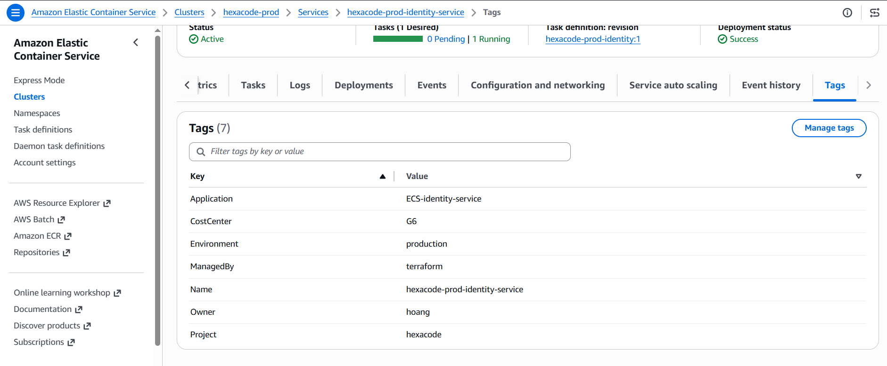

## 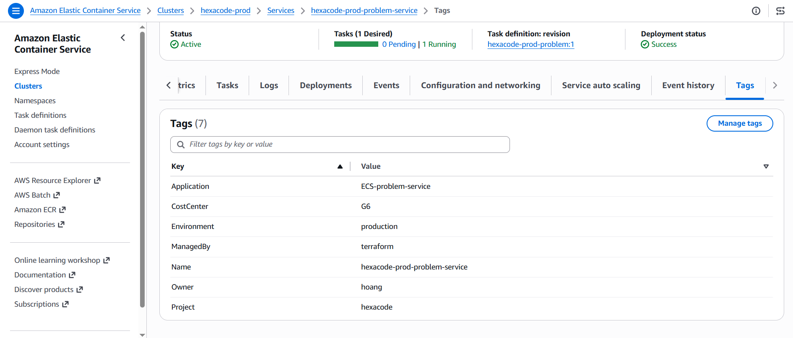

## 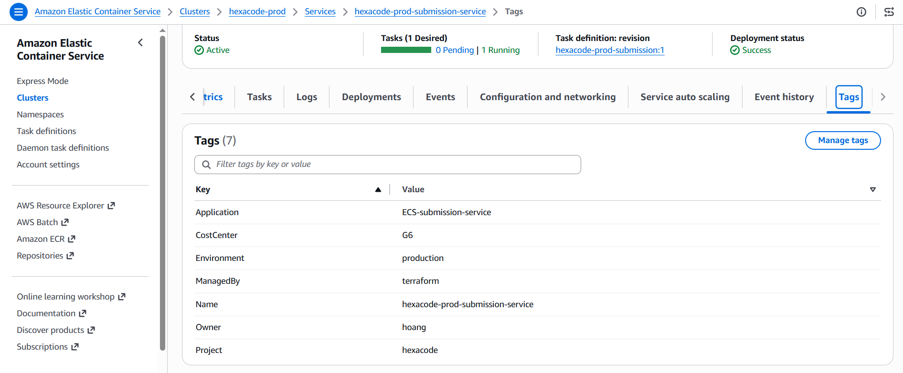

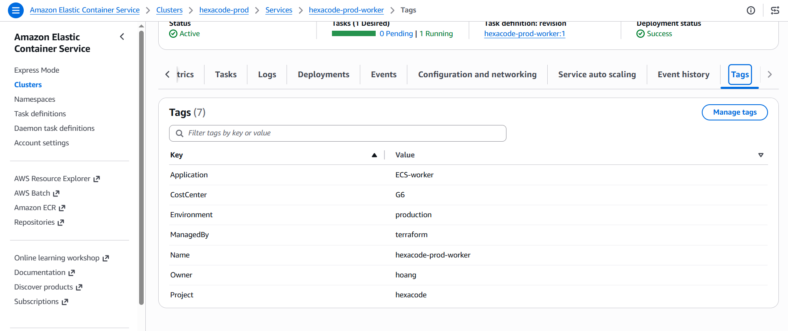 -->

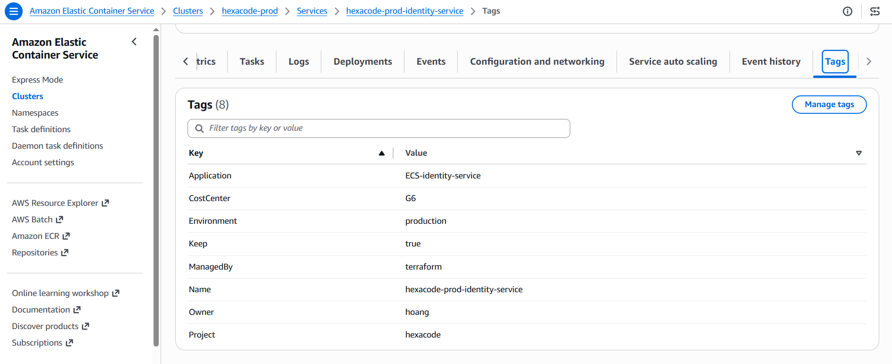

## **Screenshot tag trên RDS:**

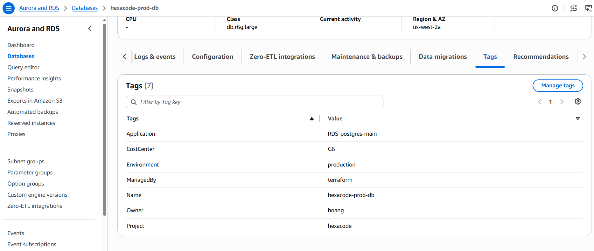

## **Screenshot tag trên Lambda:**


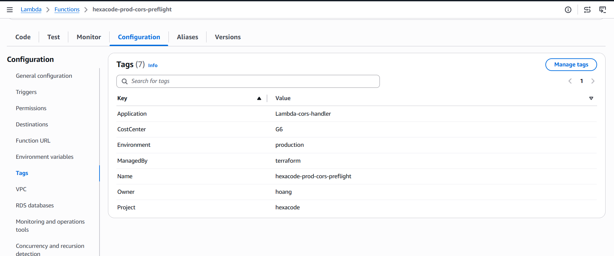

## **Screenshot tag trên S3:**

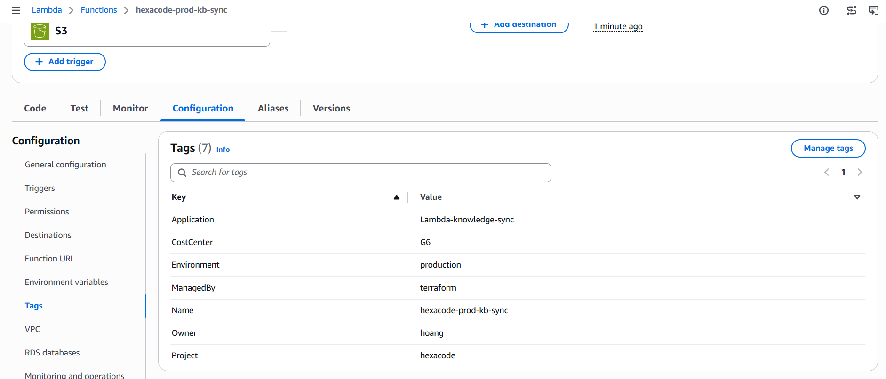

---

### 2.2 Cost Allocation Tags — Activated trong Billing Console

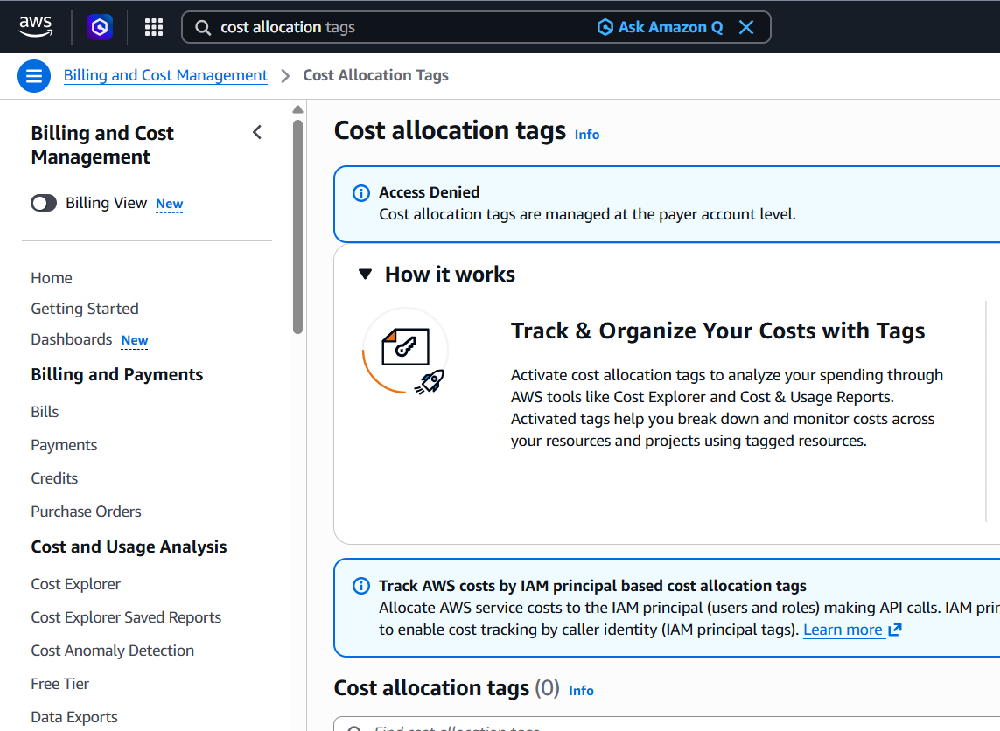

<p> => tạm thời bị ***Access Denied*** </p>

---

### 2.3 Cost Monitoring Tool(s) đã cấu hình

**Tool 1 — AWS Budgets:**

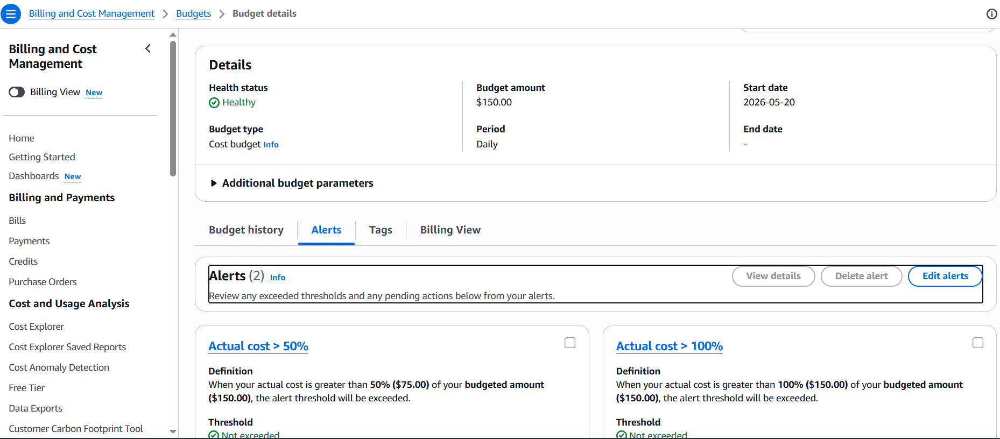

<p>Note: Có set 2 rule cho alert đó là gồm >50% or >100% thì sẽ alarm</p>

**Tool 2 — Cost Explorer filter theo tag:**

# **NHỚ BỔ SUNGGGGGGGGG**

**Tool 3 — Cost Anomaly Detection:**

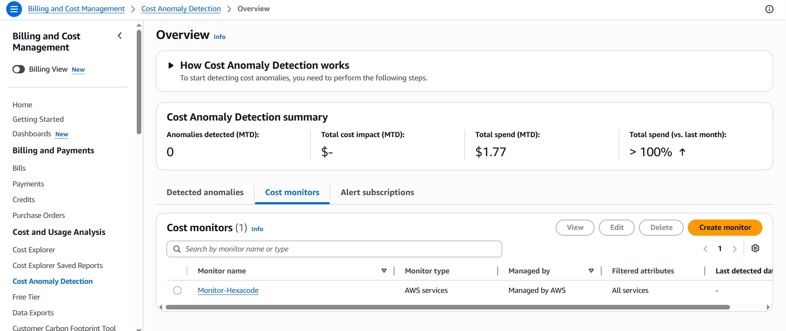

<!-- <p>Note: </p> -->

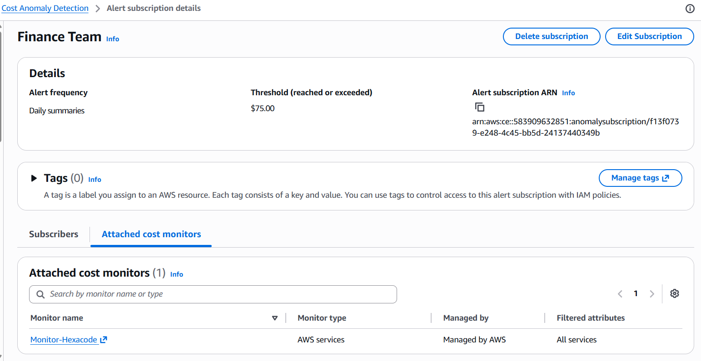

---

### 2.4 Baseline Cost Breakdown (sau ít nhất 24h data)


<p>Note: Screenshot Cost Explorer sau 24h redeploy, filter theo tag `Application=HexaCode`.</p>

**Quan sát top 3 cost driver:**

`[Viết 1 paragraph ở đây. Ví dụ: "Top 3 cost driver sau 24h redeploy: (1) RDS db.m7i.large chiếm ~45% tổng chi phí ($X) — đang chạy Multi-AZ trong dev environment, có thể tắt Multi-AZ để cắt ~50% dòng RDS. (2) NAT Gateway data processing chiếm ~25% ($X) — Lambda chatbot gọi Bedrock qua NAT, có thể chuyển sang VPC endpoint để giảm. (3) ECS Fargate chiếm ~20% ($X) — 3 services chạy liên tục kể cả khi không có traffic, có thể scale down ngoài giờ."]`

---

### 2.5 Tagging Strategy Document (1 trang)

**Tag keys được dùng:**

| Key           | Giá trị được phép          | Bắt buộc trên         |
| ------------- | -------------------------- | --------------------- |
| `Owner`       | `[email cụ thể]`           | Mọi billable resource |
| `Environment` | `dev` / `staging` / `prod` | Mọi billable resource |
| `CostCenter`  | `G6`                       | Mọi billable resource |
| `Application` | `HexaCode`                 | Mọi billable resource |

**Enforce compliance thế nào:**

`[Mô tả cách nhóm đảm bảo tag nhất quán — ví dụ: dùng AWS Config rule `required-tags`, hoặc checklist deploy thủ công, hoặc tag policy trong AWS Organizations.]`

**Giá trị không được phép:**

- `Owner`: không dùng "N/A", "unknown", hoặc bỏ trống
- `Environment`: không dùng "Dev", "DEV", "development" — chỉ dùng "dev"
- `Application`: không dùng "hexacode", "HEXACODE" — chỉ dùng "HexaCode"

**Trong account thật (production):**

`[1-2 câu về cách enforce trong production — ví dụ: Service Control Policy deny CreateInstance nếu thiếu tag bắt buộc, hoặc AWS Config alert khi resource không có tag.]`

---

## Section 3 — MH-COST-A — Cost Control & Action

### 3.1 Automated Cost Guard Lambda

**Mô tả:** Lambda function scan mọi EC2/RDS không được tag `keep=true` (hoặc `Environment=dev`) và stop chúng.

**Screenshot Lambda function:**

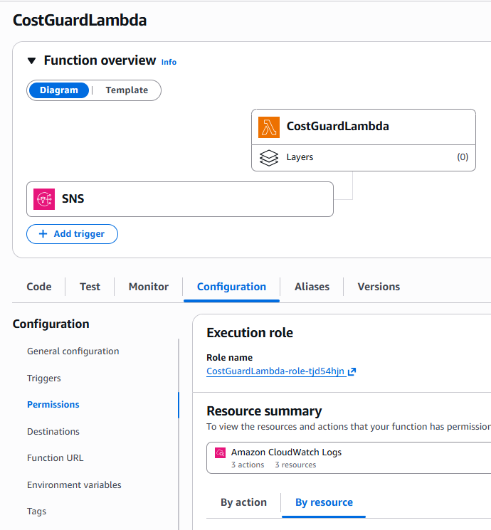

**Lambda code snippet:**

```python
import boto3
import json
from datetime import datetime

def lambda_handler(event, context):
    print(f"📨 Received event: {json.dumps(event, indent=2)}")

    # Check if this is SNS event
    if 'Records' in event and event['Records'][0].get('EventSource') == 'aws:sns':
        return handle_sns_event(event)
    else:
        # Direct invoke
        return handle_direct_invoke(event)

def handle_sns_event(event):
    """Handle SNS notification from AWS Budgets"""
    try:
        sns_message = event['Records'][0]['Sns']['Message']
        print(f"📊 Budget Alert: {sns_message}")

        # Parse budget message
        try:
            budget_data = json.loads(sns_message)
            budget_name = budget_data.get('BudgetName', 'Unknown')
            amount = budget_data.get('ActualAmount', 'Unknown')
        except:
            budget_name = "Daily Budget"
            amount = "Over $150"

        print(f"🚨 BUDGET ALERT: {budget_name} - {amount}")

        # Trigger cost optimization
        result = stop_unprotected_services()

        return {
            'statusCode': 200,
            'body': json.dumps({
                'message': f'Budget alert processed: {budget_name}',
                'cost_optimization': result
            })
        }

    except Exception as e:
        print(f"❌ Error processing SNS event: {str(e)}")
        return {'statusCode': 500, 'error': str(e)}

def handle_direct_invoke(event):
    """Handle direct invoke"""
    return stop_unprotected_services()

def stop_unprotected_services():
    """Tắt services KHÔNG CÓ tag Keep = true"""
    try:
        ecs = boto3.client('ecs', region_name='us-west-2')

        # List all services trong cluster
        services_response = ecs.list_services(cluster='hexacode-prod')
        service_arns = services_response.get('serviceArns', [])

        stopped_services = []
        protected_services = []
        errors = []

        for service_arn in service_arns:
            try:
                # Extract service name từ ARN
                service_name = service_arn.split('/')[-1]

                print(f"🔍 Checking service: {service_name}")

                # Get tags cho service
                tags_response = ecs.list_tags_for_resource(resourceArn=service_arn)
                tags = tags_response.get('tags', [])

                # Check for Keep = true tag (PROTECTION)
                is_protected = False
                for tag in tags:
                    if tag['key'].lower() == 'keep' and tag['value'].lower() == 'true':
                        is_protected = True
                        print(f"🛡️ Service {service_name} có tag Keep=true - ĐƯỢC BẢO VỆ")
                        break

                if is_protected:
                    # Service được bảo vệ, không tắt
                    protected_services.append(service_name)
                else:
                    # Service KHÔNG có tag Keep=true → TẮT
                    print(f"🎯 Service {service_name} KHÔNG có tag Keep=true - SẼ BỊ TẮT")

                    # Get current service details
                    service_details = ecs.describe_services(
                        cluster='hexacode-prod',
                        services=[service_name]
                    )

                    current_count = service_details['services'][0]['desiredCount']

                    if current_count > 0:
                        # Scale service to 0
                        response = ecs.update_service(
                            cluster='hexacode-prod',
                            service=service_name,
                            desiredCount=0
                        )
                        stopped_services.append({
                            'service': service_name,
                            'previous_count': current_count,
                            'new_count': 0,
                            'reason': 'no_keep_tag'
                        })
                        print(f"🛑 STOPPED service: {service_name} (was running {current_count} tasks)")
                    else:
                        print(f"ℹ️ Service {service_name} already stopped")
                        stopped_services.append({
                            'service': service_name,
                            'previous_count': 0,
                            'new_count': 0,
                            'note': 'already_stopped'
                        })

            except Exception as e:
                error_msg = f"❌ ERROR processing {service_name}: {str(e)}"
                errors.append(error_msg)
                print(error_msg)

        result = {
            'timestamp': datetime.now().isoformat(),
            'stopped_services': stopped_services,
            'protected_services': protected_services,
            'errors': errors,
            'summary': {
                'stopped_count': len(stopped_services),
                'protected_count': len(protected_services),
                'error_count': len(errors)
            }
        }

        print(f"📊 SUMMARY:")
        print(f"   🛑 Stopped: {len(stopped_services)} services (no Keep=true tag)")
        print(f"   🛡️ Protected: {len(protected_services)} services (has Keep=true tag)")
        print(f"   ❌ Errors: {len(errors)}")

        return {
            'statusCode': 200,
            'body': json.dumps(result, indent=2)
        }

    except Exception as e:
        error_msg = f"❌ Error in cost optimization: {str(e)}"
        print(error_msg)
        return {
            'statusCode': 500,
            'body': json.dumps({'error': error_msg})
        }
```

---

### 3.2 IAM Role — Least Privilege

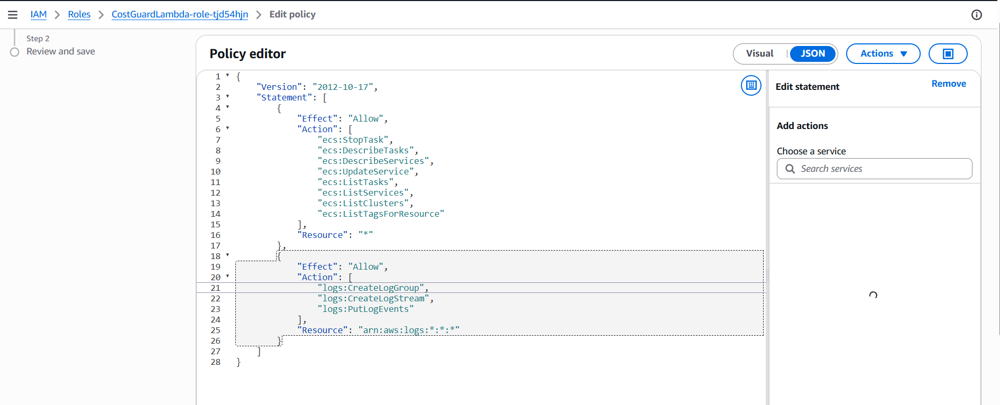
Role này được attach vào:

- Lambda automation

  - detect abnormal ECS cost
  - auto stop ECS tasks/services
  - cleanup workload

- Cho phép lambda ghi logs vào **_Cloudwatch Logs_**.

---

### 3.3 EventBridge Daily Schedule

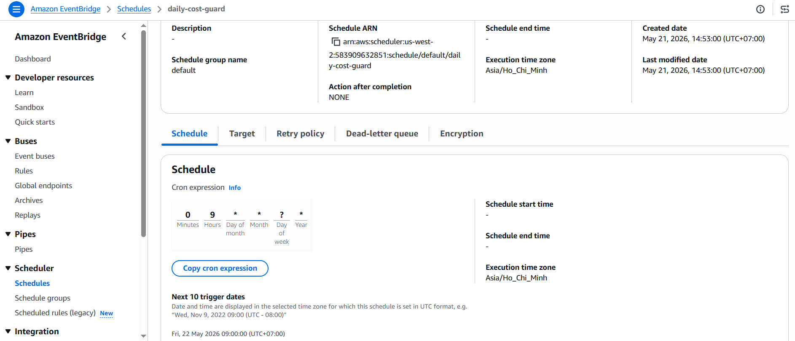

<p>Note: EventBridge Scheduler cron chạy daily lúc 9g sáng mỗi ngày theo múi giờ Việt Nam -> invoke Cost Guard Lambda. Schedule đã enable.</p>

---

### 3.4 Demonstrated Stop — Before/After + CloudTrail

**Before — Instance đang Running:**

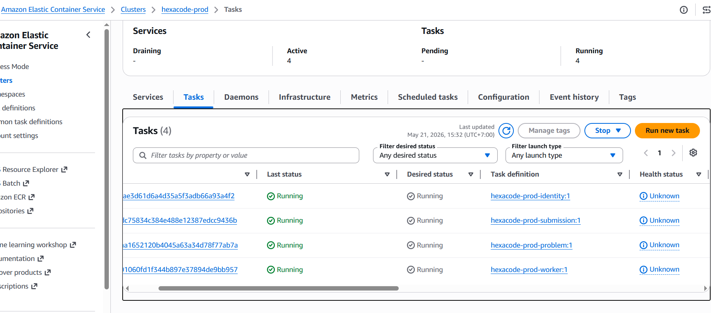

    Ban đầu 4 services chạy bình thường

**Lambda - Triggered:**
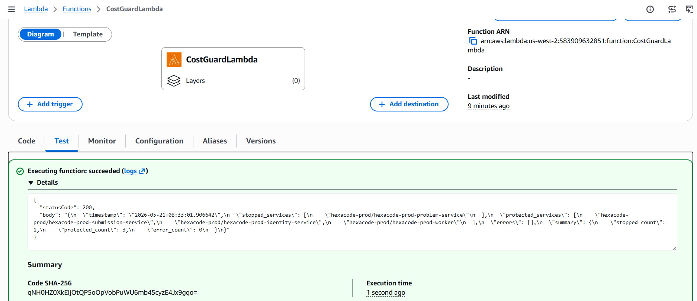

    lambda func được kích hoạt

**After — Instance đã Stopped:**

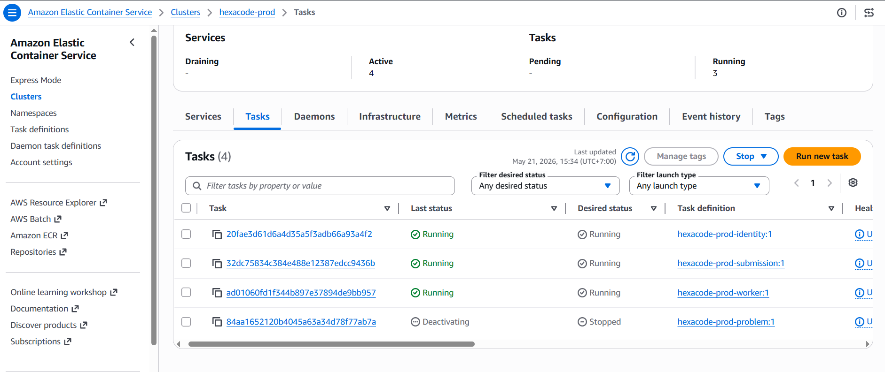

Service Problem bị stopped vì tag của problem service đó không có **_Keep = true_**

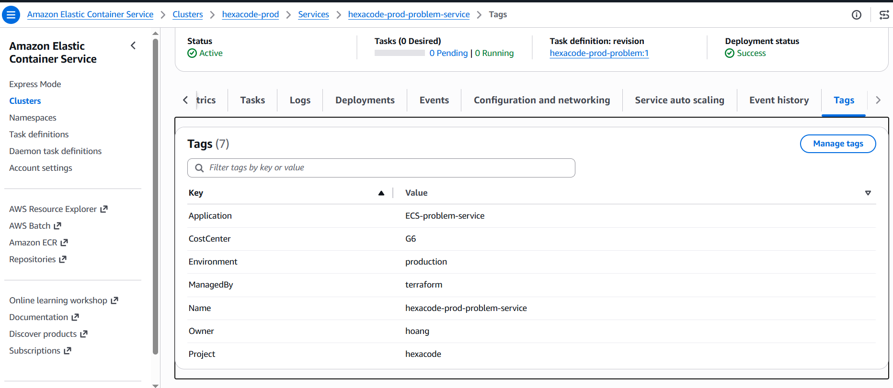

**CloudTrail event `StopInstances` / `StopDBInstance`:**

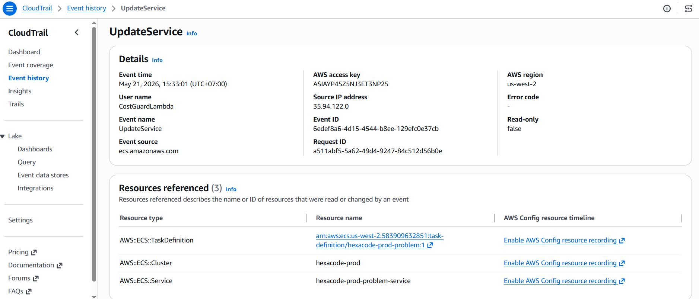

    -> gọi API UpdateService để stop 1 ECS Service.

---

### 3.5 Budgets daily $150 → SNS → Lambda (Wire + Demo)

    Before:

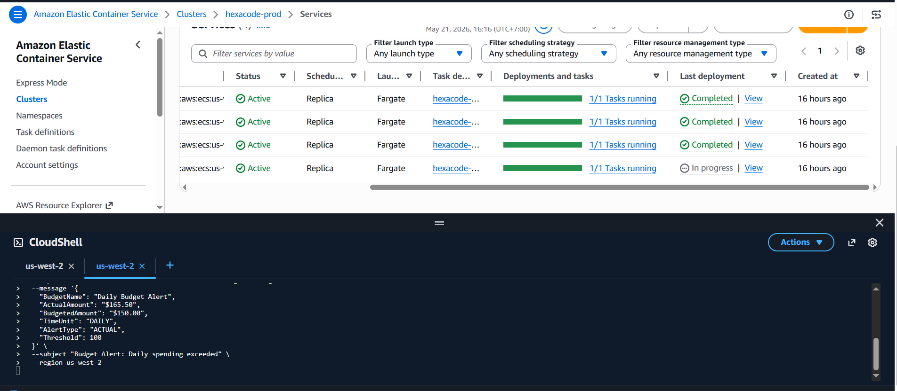

    After:

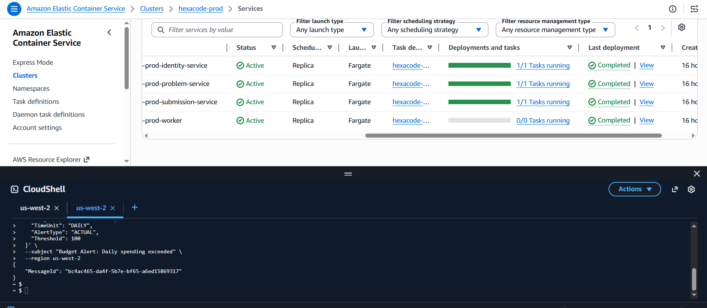

---

### 3.6 Cost Data Latency — ADR

**Architecture Decision Record:**

**Context:** AWS cost data có độ trễ ~8–24 giờ trước khi xuất hiện trong Cost Explorer và Budgets. Trong một account workshop 48 giờ, cost-driven trigger từ Budgets gần như sẽ không fire vì data chưa kịp cập nhật.

**Decision:** Wire Budgets daily $150 → SNS → Lambda (đảm bảo chain tồn tại và test được), đồng thời dùng EventBridge Scheduler daily cron làm primary trigger đáng tin trong môi trường workshop.

**Consequences:** Trong production thật (account chạy nhiều tuần), Budgets cost-driven trigger sẽ fire bình thường sau 24h data. Chain đã được wire và test bằng SNS manual publish — behavior production đã được xác nhận.

---

## Section 4 — MH-OBS — CloudWatch Observability

### 4.1 CloudWatch Dashboard


<sub>Note: Dashboard với 3 widget: (1) Custom metric `[tên metric]`, (2) Standard metric Lambda Error Rate, (3) Standard metric RDS DatabaseConnections. Mọi widget đều có data point thật.</sub>

---

### 4.2 Custom Metric — `PutMetricData` Code Snippet

**Metric đo gì:** `[e.g. Bedrock agent invocation latency ms]`

```python
import boto3
import time

cloudwatch = boto3.client('cloudwatch')

def handler(event, context):
    start = time.time()

    # [Business logic của app ở đây — gọi Bedrock, query DB, v.v.]

    latency_ms = (time.time() - start) * 1000

    cloudwatch.put_metric_data(
        Namespace='HexaCode/Operations',
        MetricData=[{
            'MetricName': 'BedrockAgentLatencyMs',
            'Value': latency_ms,
            'Unit': 'Milliseconds',
            'Dimensions': [
                {'Name': 'FunctionName', 'Value': 'hexacode-prod-chat'},
                {'Name': 'Environment', 'Value': 'dev'}
            ]
        }]
    )
```


<sub>Note: Custom metric `BedrockAgentLatencyMs` trong namespace `HexaCode/Operations` — thấy data points thật từ Lambda invocations.</sub>

---

### 4.3 CloudWatch Alarm — Trạng thái OK hoặc ALARM


<sub>Note: Alarm configuration — metric name, threshold, evaluation period (e.g. Lambda Errors > 5 trong 5 phút), action destination (SNS topic). Alarm đang ở trạng thái OK hoặc ALARM — không phải INSUFFICIENT_DATA.</sub>


<sub>Note: Alarm state screenshot chụp gần Thứ Sáu — xác nhận metric đã có data point để evaluate. Nếu cần, invoke Lambda với bad input 6 lần vào Thứ Năm để trigger alarm.</sub>

---

### 4.4 Log Insights Query — Saved

**Query text:**

```
# Lambda error spikes by 5-minute window
fields @timestamp, @message
| filter @message like /ERROR/
| stats count(*) as error_count by bin(5m)
| sort @timestamp desc
```

**Log group chạy chống lại:** `/aws/lambda/hexacode-prod-chat`


<sub>Note: Query trả về ít nhất 5 result rows thật. Thấy tên query đã save trong danh sách Saved Queries.</sub>


<sub>Note: Saved query name nhìn thấy trong CloudWatch → Log Insights → Saved Queries.</sub>

---

## Section 5 — MH-SEC — Self-Healing Security Guard

### 5.1 Security Guard Lambda

**Misconfiguration detect và fix:** `[e.g. S3 bucket bị set public → Lambda gọi PutPublicAccessBlock]`
hoặc `[e.g. Security Group ingress 0.0.0.0/0 trên port 22 → Lambda gọi RevokeSecurityGroupIngress]`

**Screenshot Lambda function:**


<sub>Note: Lambda function đã deploy với least-privilege IAM role.</sub>

**Lambda code snippet:**

```python
import boto3

s3 = boto3.client('s3')

def handler(event, context):
    # Lấy bucket name từ CloudTrail event (nếu trigger từ EventBridge)
    bucket_name = event.get('detail', {}).get('requestParameters', {}).get('bucketName')

    if not bucket_name:
        # Fallback: scan tất cả bucket nếu trigger từ scheduled cron
        buckets = s3.list_buckets()['Buckets']
        for bucket in buckets:
            check_and_fix_bucket(bucket['Name'])
        return

    check_and_fix_bucket(bucket_name)

def check_and_fix_bucket(bucket_name):
    try:
        status = s3.get_public_access_block(Bucket=bucket_name)
        config = status['PublicAccessBlockConfiguration']
        if not all(config.values()):
            s3.put_public_access_block(
                Bucket=bucket_name,
                PublicAccessBlockConfiguration={
                    'BlockPublicAcls': True,
                    'IgnorePublicAcls': True,
                    'BlockPublicPolicy': True,
                    'RestrictPublicBuckets': True
                }
            )
            print(f"Fixed public access on bucket: {bucket_name}")
    except Exception as e:
        print(f"Error checking bucket {bucket_name}: {e}")
```

---

### 5.2 IAM Role — Least Privilege


<sub>Note: IAM execution role chỉ có `s3:PutPublicAccessBlock`, `s3:GetBucketPolicyStatus`, `s3:ListAllMyBuckets` — hoặc `ec2:RevokeSecurityGroupIngress`, `ec2:DescribeSecurityGroups`. Không có wildcard.</sub>

---

### 5.3 EventBridge Trigger

**Trigger type đã chọn:** `[ ] EventBridge rule trên CloudTrail event` &nbsp;&nbsp; `[ ] EventBridge Scheduler daily cron`


<sub>Note: EventBridge rule trên event source `aws.s3` / event `PutBucketPolicy` / `PutBucketAcl` — hoặc daily cron schedule. Rule đang Enabled.</sub>

---

### 5.4 Demo Vòng Lặp Detect → Fix

**Before — Vi phạm được tạo cố ý:**


<sub>Note: S3 bucket bị set public (Block Public Access tắt) — hoặc Security Group có rule 0.0.0.0/0 port 22. Đây là trạng thái "insecure" trước khi Lambda chạy.</sub>

**After — Lambda đã fix:**


<sub>Note: Cùng bucket/SG sau khi Lambda detect và remediate — Block Public Access bật lại / rule 0.0.0.0/0 đã bị revoke.</sub>

**CloudTrail event của lần gọi fix API:**


<sub>Note: CloudTrail event `PutPublicAccessBlock` / `RevokeSecurityGroupIngress` — thấy eventName, eventTime, userAgent (Lambda role ARN), và resource bị fix. Đây là bằng chứng remediation đã thực sự chạy.</sub>

---

### 5.5 Supporting Preventive Control

**Path đã chọn:** `[ ] Path A — KMS CMK` &nbsp;&nbsp; `[ ] Path B — S3 Block Public Access account-level` &nbsp;&nbsp; `[ ] Path C — IAM Access Analyzer`

---

**Nếu Path A — KMS CMK:**


<sub>Note: Customer Managed Key `alias/hexacode-rds-prod` đã tạo, Symmetric, key rotation Enabled.</sub>


<sub>Note: RDS / EFS / S3 đã được modify để dùng CMK (không phải aws/rds hay aws/s3 — AWS-managed key).</sub>


<sub>Note: CloudTrail event `kms:GenerateDataKey` từ `rds.amazonaws.com` / `s3.amazonaws.com` — xác nhận CMK đang được dùng active khi data được encrypt/decrypt.</sub>

---

**Nếu Path B — S3 Block Public Access account-level:**


<sub>Note: S3 console → Block Public Access settings for this account → cả 4 setting đều ON.</sub>


<sub>Note: Bucket policy deny PutObject non-TLS (`aws:SecureTransport=false`).</sub>


<sub>Note: Test call bị policy reject — xác nhận enforce đang hoạt động.</sub>

---

**Nếu Path C — IAM Access Analyzer:**


<sub>Note: IAM Access Analyzer đã enable trong account.</sub>


<sub>Note: ≥1 external-access finding được surface. Triage decision: finding này là gì, có phải intended không, production remediation là gì.</sub>

---

### 5.6 Security Threat Statement

**Guard fix misconfiguration gì:**
`[e.g. "S3 bucket chứa Bedrock KB documents bị set public — mọi người trên internet có thể đọc toàn bộ nội dung knowledge base của app."]`

**Blast radius nếu không remediate:**
`[e.g. "Toàn bộ 36 markdown documents của GeekBrain — bao gồm incident postmortems, SLA targets, team structure — bị lộ công khai. Kẻ tấn công có thể dùng thông tin này để social engineer hoặc target specific vulnerabilities."]`

---

### 5.7 Security-Cost Trade-off Statement

`[1-2 câu nêu tên cost cụ thể và justification. Ví dụ: "KMS CMK tốn $1/tháng per key. Justified vì mỗi decrypt event được log kèm IAM principal — đây là audit trail bắt buộc khi data store chứa thông tin thi cử của người dùng. Cost $1/tháng nhỏ hơn nhiều so với rủi ro compliance khi không có audit trail."]`

---

## Section 6 — Project Recap

### Ứng dụng là gì

`[Mô tả ngắn: HexaCode là một coding practice platform cho phép người dùng luyện tập bài tập lập trình, nộp bài, và nhận hỗ trợ từ AI chatbot.]`

### Business Domain

`[e.g. EdTech / Competitive Programming / Online Judge]`

### Các quyết định kiến trúc và thiết kế chính từ W1-W5

| Tuần | Quyết định chính                                                                                                 |
| ---- | ---------------------------------------------------------------------------------------------------------------- |
| W1   | `[e.g. 3-tier architecture: CloudFront → API Gateway → ECS Fargate → RDS]`                                       |
| W2   | `[e.g. S3 cho static assets, IAM baseline với MFA trên root]`                                                    |
| W3   | `[e.g. RDS PostgreSQL / relational vì data có JOIN phức tạp giữa users-submissions-problems]`                    |
| W4   | `[e.g. Bedrock Agent với Knowledge Base, Lambda orchestrator, Hybrid Search K=10]`                               |
| W5   | `[e.g. VPC Peering Production↔Management, Network Firewall với domain allowlist, EFS mount, API Gateway + auth]` |
| W6   | `[e.g. Cost tagging discipline, automated cost guard, CloudWatch observability, self-healing security]`          |

### W5 Feedback đã giải quyết _(tuỳ chọn)_

`[e.g. "Trainer W5 feedback: MH5 scaling pattern chưa có visual evidence. W6 đã thêm CloudWatch Throttles metric screenshot cho Reserved Concurrency."]`

---

## Bonus _(Tuỳ chọn)_

> Chỉ điền nếu đã hoàn tất cả 4 must-have và Evidence Pack.

### B1 `[ ]` gp2 → gp3 EBS Migration (+0.25)

**Before (gp2):**


<sub>Note: Volume type gp2, IOPS và BurstBalance baseline từ CloudWatch.</sub>

**After (gp3):**


<sub>Note: Volume type gp3, IOPS/throughput đã cấu hình, cost delta so với gp2.</sub>

---

### B2 `[ ]` Trusted Advisor Remediations (+0.25)

**Finding 1:**


<sub>Note: Finding → Action taken → Before/After.</sub>

**Finding 2:**


<sub>Note: Finding → Action taken → Before/After.</sub>

---

### B3 `[ ]` RI / Savings Plans Break-even Analysis (+0.25)

`[Viết analysis với con số thật. Ví dụ: "Break-even cho 1-year Compute Savings Plan trên ECS Fargate: on-demand cost $X/tháng × 12 = $Y. Savings Plan commitment $Z × 12 = $W. Break-even tại tháng thứ N. Vòng đời workshop 1 tuần → không mua. Sẽ mua khi sustained spend > $X/tháng trong 3+ tháng liên tiếp."]`

---

### B4 `[ ]` "Wasteful → Changed" Reflection (+0.25)

`[100-150 từ với con số thật: tìm thấy gì lãng phí, đã thay đổi gì, cost/performance delta là bao nhiêu.]`

---

### B5 `[ ]` Cost Anomaly Automation (+0.25)


<sub>Note: Monitor scope về `Application=HexaCode`, EventBridge rule trên `aws.costanomalydetection`, SNS notification nhận được.</sub>

---

### B6 `[ ]` CloudFormation Template cho một resource W6 (+0.25)

```yaml
# Paste CFN template snippet ở đây
# Provision Security Guard Lambda + EventBridge trigger + IAM role
```


<sub>Note: `aws cloudformation validate-template` output — template pass validation.</sub>

---

_— End of W6 Evidence Pack —_
