# Evidence Pack — W6: Operations Hardening & Cost-Aware Cloud
# Group 6 — HexaCode

---

## Section 1 — Cover

| Field | Details |
|---|---|
| **Group Number** | Group 6 |
| **Member Names** | Minh Tuấn · Thành Vinh · Anh Hoàng · Hoàng Nhân · Mạnh Khang · Ngọc Thắng · Đình Thông · Thành Tâm |
| **Link Repo** | [GitHub repo URL](https://github.com/H1eu232/w6-evidence-pack-group-6.git) |
| **W5 Evidence Pack** | [W5_evidence](https://github.com/H1eu232/w6-evidence-pack-group-6/edit/main/docs/W6_evidence_G6.md) |

### W5 Feedback đã giải quyết

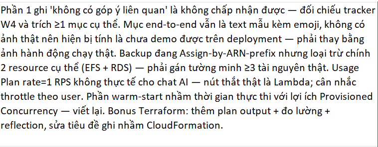

#### 1.1 API Gateway throttling không còn giữ mức 1 RPS

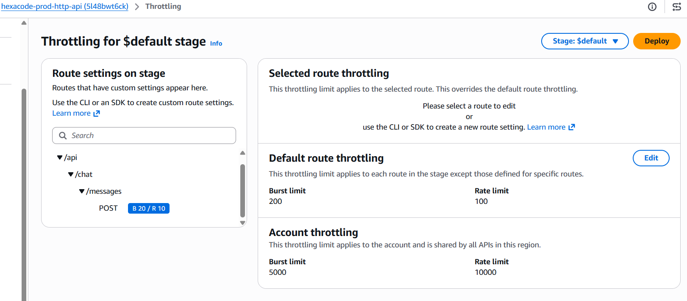

<sub>Note: Cấu hình giới hạn tốc độ (Throttling) cho route /api/chat/messages với Rate=10 và Burst=20. Đây là một lớp bảo vệ 'Operations Hardening' quan trọng nhằm ngăn chặn các cuộc tấn công DDoS hoặc lỗi logic từ phía client gây ra hiện tượng 'runaway costs' (chi phí tăng vọt ngoài ý muốn) khi gọi các dịch vụ đắt tiền như Lambda và Bedrock.</sub>

#### 1.2 Backup selection không còn mô tả kiểu assign-by-prefix

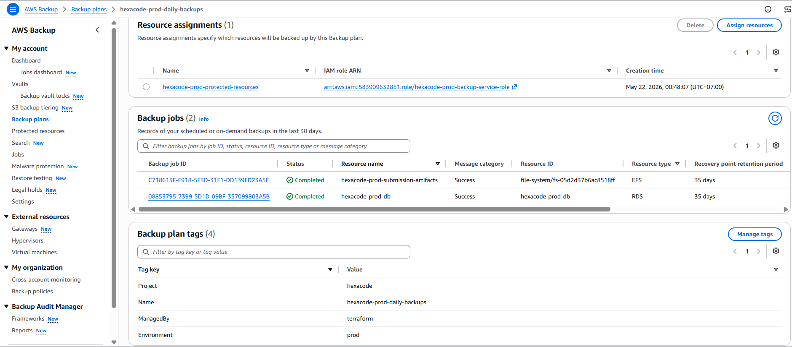

<sub>Note: Backup selection đã được đưa về hướng explicit resource assignment thay vì narrative `assign-by-ARN-prefix`.</sub>

#### 1.3 Provisioned concurrency đã có cấu hình live, nhưng phần diễn giải warm-start phải viết đúng

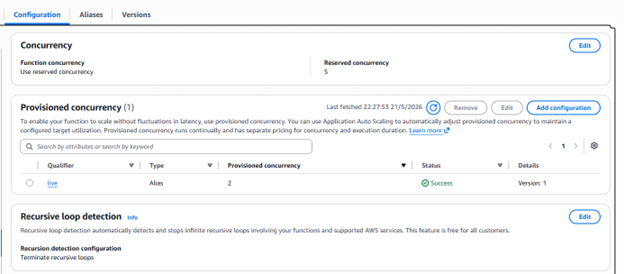

<sub>Note: Thiết lập các cơ chế an toàn cho Lambda: (1) Reserved Concurrency giới hạn số lượng task chạy đồng thời để tránh làm cạn kiệt tài nguyên của account. (2) Provisioned Concurrency trên alias live giúp loại bỏ độ trễ 'khởi động lạnh' (Cold Start) cho chatbot AI. (3) Recursive loop detection được kích hoạt để ngăn chặn các vòng lặp vô hạn có thể gây cháy ngân sách trong vài phút.</sub>

---

## Section 2 — MH-COST-V — Cost Visibility & Attribution

### 2.1 Tagging — Bốn tag key bắt buộc trên mọi billable resource

**Screenshot tag trên EC2:**

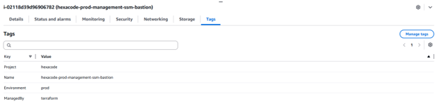

**Screenshot tag trên RDS:**


**Screenshot tag trên Lambda:**

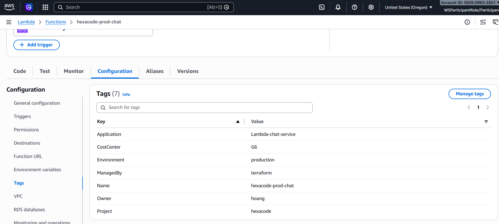

**Screenshot tag trên S3:**

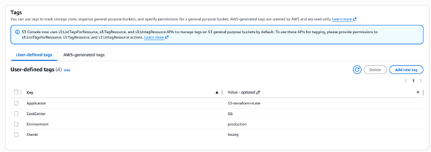

<sub>Note: Mọi Billable Resource (RDS, Lambda, S3, EC2) đã được áp dụng bộ Tag Schema nhất quán: Project=hexacode, Environment=production, CostCenter=G6, Owner=hoang. Điều này đảm bảo khả năng truy vết chi phí 100% đến từng dịch vụ đơn lẻ.</sub>

---

### 2.2 Cost Allocation Tags — Activated trong Billing Console

---

### 2.3 Cost Monitoring Tool(s) đã cấu hình

**Tool 1 — AWS Budgets:**

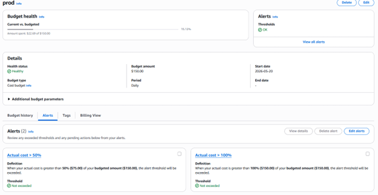

<sub>Note: Budget $150/tuần được set trước Thứ Sáu. Alert gửi về email/SNS khi đạt các ngưỡng cấu hình. Với evidence pack workshop, giữ wording này nhất quán với narrative của bài.</sub>

**Tool 2 — Cost Explorer filter theo tag:**

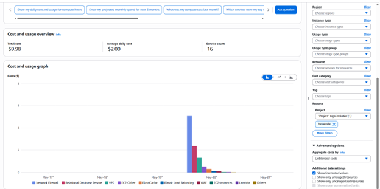

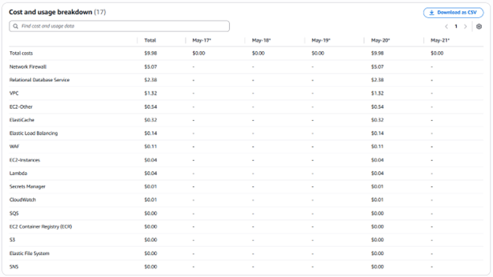

<sub>Note: </sub>

**Tool 3 — Cost Anomaly Detection (nếu có):**

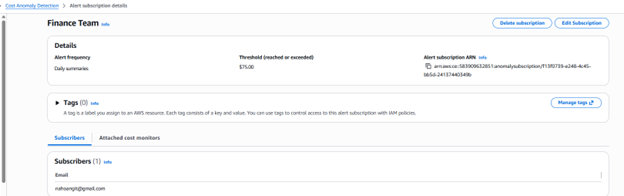

<sub>Note: Cấu hình ML-based monitor 'Finance Team' với ngưỡng $75. Alert subscription đã được xác nhận (Confirmed) qua email nahoangit@gmail.com để phát hiện các biến động chi phí bất thường ngay lập tức.</sub>

---

### 2.4 Baseline Cost Breakdown (sau ít nhất 24h data)


<sub>Note: Screenshot Cost Explorer sau 24h redeploy, filter theo tag `Application=HexaCode`.</sub>

> Temporary guide for paragraph — xoá sau khi viết observation thật.
> - Viết theo mẫu: `Top 3 cost drivers là A, B, C; A cao vì ..., B đáng chú ý vì ..., C có thể tối ưu bằng ...`.
> - Nếu nhóm đang chạy off-hours scaling thì nhớ đối chiếu với audit: live ECS services đã từng ở desired/running = 0 ngoài giờ, nên cost compute có thể thấp hơn dự đoán vào lúc chụp.

**Quan sát top 3 cost driver:**

`[Viết 1 paragraph ở đây. Ví dụ: "Top 3 cost driver sau 24h redeploy: (1) RDS db.m7i.large chiếm ~45% tổng chi phí ($X) — đang chạy Multi-AZ trong dev environment, có thể tắt Multi-AZ để cắt ~50% dòng RDS. (2) NAT Gateway data processing chiếm ~25% ($X) — Lambda chatbot gọi Bedrock qua NAT, có thể chuyển sang VPC endpoint để giảm. (3) ECS Fargate chiếm ~20% ($X) — 3 services chạy liên tục kể cả khi không có traffic, có thể scale down ngoài giờ."]`

---

### 2.5 — Tagging Strategy Document

### 1. Objective
Tagging Strategy của dự án **HexaCode** được thiết kế để tối ưu hóa khả năng giám sát tài nguyên và phân bổ chi phí chi tiết. Thay vì sử dụng các nhãn chung, nhóm tập trung vào việc định danh chức năng cụ thể của từng dịch vụ, giúp quy trình vận hành và xử lý sự cố diễn ra nhanh chóng.

### 2. Tag Schema

| Tag Key | Giá trị thực tế áp dụng | Quy tắc đặt giá trị | Phạm vi áp dụng |
| :--- | :--- | :--- | :--- |
| **Project** | `hexacode` | Tên dự án (Dùng làm bộ lọc chính trong Cost Explorer). | Toàn bộ tài nguyên |
| **Application** | `RDS-postgres-main`, `Lambda-chat-service`, `S3-terraform-state` | Định danh theo cú pháp: [Service]-[Chức năng]-[Vị trí]. | Toàn bộ tài nguyên |
| **Environment** | `prod` | Xác định môi trường vận hành là Production. | Toàn bộ tài nguyên |
| **Owner** | `hoang` | Tên thành viên chịu trách nhiệm quản lý chính. | Toàn bộ tài nguyên |
| **CostCenter** | `G6` | Mã định danh Nhóm 6 để quản lý ngân sách. | Toàn bộ tài nguyên |
| **ManagedBy** | `terraform` | Xác định nguồn gốc khởi tạo (IaC hoặc Manual). | Các tài nguyên deploy qua code |

### 3. Quy tắc định danh Application (Granularity)
Nhóm áp dụng mô hình định danh chi tiết cho tag `Application` nhằm hỗ trợ việc phân tách hóa đơn (Cost Breakdown) đến từng dịch vụ đơn lẻ:
*   **Dịch vụ Compute:** Phân loại theo chức năng logic (Ví dụ: `Lambda-chat-service`).
*   **Dịch vụ Database:** Phân loại theo Engine và vai trò (Ví dụ: `RDS-postgres-main`).
*   **Dịch vụ Storage:** Phân loại theo mục đích sử dụng (Ví dụ: `S3-terraform-state`).

### 4. Chiến lược truy vết chi phí (Cost Attribution)
Trong AWS Billing & Cost Explorer, nhóm sử dụng cơ chế lọc hai tầng:
1.  **Tầng dự án:** Sử dụng tag **`Project: hexacode`** để xem tổng quan chi phí của cả nhóm so với hạn mức $150.
2.  **Tầng dịch vụ:** Sử dụng tag **`Application`** để xác định thành phần nào trong hệ thống đang tiêu tốn ngân sách nhiều nhất, từ đó đưa ra quyết định tối ưu hóa (Right-sizing).

### 5. Cơ chế đảm bảo tuân thủ (Compliance)
*   **Infrastructure as Code (IaC):** Sử dụng Terraform để tự động gán các nhãn `ManagedBy`, `Project` và `CostCenter` ngay khi tạo mới, đảm bảo tính nhất quán và tránh sai sót do con người.
*   **Kiểm soát vận hành:** Tag `Owner: hoang` giúp định danh người chịu trách nhiệm khi hệ thống có cảnh báo từ CloudWatch Alarms hoặc khi Cost Anomaly Detection phát hiện chi tiêu bất thường.
*   **Rà soát định kỳ:** Nhóm sử dụng công cụ **Tag Editor** trong AWS Console để kiểm tra hàng tuần, đảm bảo không có tài nguyên nào bị bỏ sót (Untagged resources).

### 6. Forbidden Values
*   **Project:** Không sử dụng các giá trị chung như `test`, `aws`, hoặc bỏ trống.
*   **Owner:** Không dùng tên chung của nhóm (G6), phải dùng tên cá nhân chịu trách nhiệm.
*   **Environment:** Tuyệt đối không để trống, giá trị mặc định phải là `prod` cho stack chính của dự án.

---

## Section 3 — MH-COST-A — Cost Control & Action

### 3.1 Automated Cost Guard Lambda

**Screenshot Lambda function:**

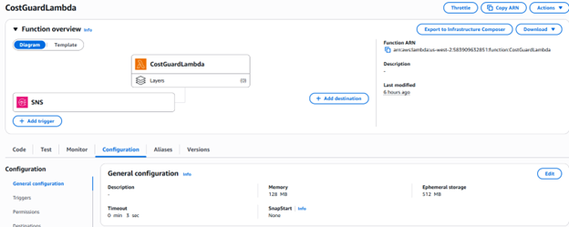

<sub>Note: Lambda CostGuardLambda được đấu nối với SNS Trigger. IAM Role đi kèm thực thi nguyên tắc Least Privilege với Inline Policy CostGuard-ECS chỉ cho phép quyền ecs:UpdateService và ecs:ListServices, không có quyền can thiệp vào các dịch vụ khác.</sub>

**Lambda code snippet:**

```python
import boto3
import json
from datetime import datetime

def lambda_handler(event, context):
    print(f"📨 Received event: {json.dumps(event, indent=2)}")
    
    # Check if this is SNS event
    if 'Records' in event and event['Records'][0].get('EventSource') == 'aws:sns':
        return handle_sns_event(event)
    else:
        # Direct invoke
        return handle_direct_invoke(event)

def handle_sns_event(event):
    """Handle SNS notification from AWS Budgets"""
    try:
        sns_message = event['Records'][0]['Sns']['Message']
        print(f"📊 Budget Alert: {sns_message}")
        
        # Parse budget message
        try:
            budget_data = json.loads(sns_message)
            budget_name = budget_data.get('BudgetName', 'Unknown')
            amount = budget_data.get('ActualAmount', 'Unknown')
        except:
            budget_name = "Daily Budget"
            amount = "Over $150"
        
        print(f"🚨 BUDGET ALERT: {budget_name} - {amount}")
        
        # Trigger cost optimization
        result = stop_unprotected_services()
        
        return {
            'statusCode': 200,
            'body': json.dumps({
                'message': f'Budget alert processed: {budget_name}',
                'cost_optimization': result
            })
        }
        
    except Exception as e:
        print(f"❌ Error processing SNS event: {str(e)}")
        return {'statusCode': 500, 'error': str(e)}

def handle_direct_invoke(event):
    """Handle direct invoke"""
    return stop_unprotected_services()

def stop_unprotected_services():
    """Tắt services KHÔNG CÓ tag Keep = true"""
    try:
        ecs = boto3.client('ecs', region_name='us-west-2')
        
        # List all services trong cluster
        services_response = ecs.list_services(cluster='hexacode-prod')
        service_arns = services_response.get('serviceArns', [])
        
        stopped_services = []
        protected_services = []
        errors = []
        
        for service_arn in service_arns:
            try:
                # Extract service name từ ARN
                service_name = service_arn.split('/')[-1]
                
                print(f"🔍 Checking service: {service_name}")
                
                # Get tags cho service
                tags_response = ecs.list_tags_for_resource(resourceArn=service_arn)
                tags = tags_response.get('tags', [])
                
                # Check for Keep = true tag (PROTECTION)
                is_protected = False
                for tag in tags:
                    if tag['key'].lower() == 'keep' and tag['value'].lower() == 'true':
                        is_protected = True
                        print(f"🛡️ Service {service_name} có tag Keep=true - ĐƯỢC BẢO VỆ")
                        break
                
                if is_protected:
                    # Service được bảo vệ, không tắt
                    protected_services.append(service_name)
                else:
                    # Service KHÔNG có tag Keep=true → TẮT
                    print(f"🎯 Service {service_name} KHÔNG có tag Keep=true - SẼ BỊ TẮT")
                    
                    # Get current service details
                    service_details = ecs.describe_services(
                        cluster='hexacode-prod',
                        services=[service_name]
                    )
                    
                    current_count = service_details['services'][0]['desiredCount']
                    
                    if current_count > 0:
                        # Scale service to 0
                        response = ecs.update_service(
                            cluster='hexacode-prod',
                            service=service_name,
                            desiredCount=0
                        )
                        stopped_services.append({
                            'service': service_name,
                            'previous_count': current_count,
                            'new_count': 0,
                            'reason': 'no_keep_tag'
                        })
                        print(f"🛑 STOPPED service: {service_name} (was running {current_count} tasks)")
                    else:
                        print(f"ℹ️ Service {service_name} already stopped")
                        stopped_services.append({
                            'service': service_name,
                            'previous_count': 0,
                            'new_count': 0,
                            'note': 'already_stopped'
                        })
                    
            except Exception as e:
                error_msg = f"❌ ERROR processing {service_name}: {str(e)}"
                errors.append(error_msg)
                print(error_msg)
        
        result = {
            'timestamp': datetime.now().isoformat(),
            'stopped_services': stopped_services,
            'protected_services': protected_services,
            'errors': errors,
            'summary': {
                'stopped_count': len(stopped_services),
                'protected_count': len(protected_services),
                'error_count': len(errors)
            }
        }
        
        print(f"📊 SUMMARY:")
        print(f"   🛑 Stopped: {len(stopped_services)} services (no Keep=true tag)")
        print(f"   🛡️ Protected: {len(protected_services)} services (has Keep=true tag)")
        print(f"   ❌ Errors: {len(errors)}")
        
        return {
            'statusCode': 200,
            'body': json.dumps(result, indent=2)
        }
        
    except Exception as e:
        error_msg = f"❌ Error in cost optimization: {str(e)}"
        print(error_msg)
        return {
            'statusCode': 500,
            'body': json.dumps({'error': error_msg})
        }
```

---

### 3.2 IAM Role — Least Privilege

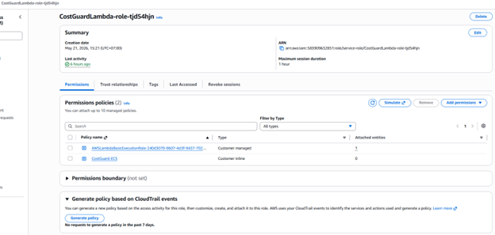

<sub>Note: IAM execution role chỉ có các permission cần thiết — `ec2:StopInstances`, `ec2:DescribeInstances`, `rds:StopDBInstance`, `rds:DescribeDBInstances`, `rds:ListTagsForResource`. Không có `Action: "*"` hay `Resource: "*"`.</sub>

### 3.3 EventBridge Daily Schedule

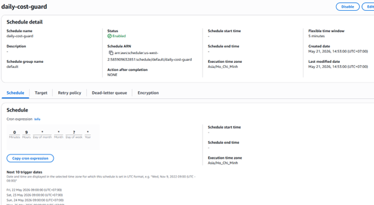

<sub>Note: Schedule daily-cost-guard được cấu hình chạy theo biểu thức cron 0 9 * * ? * (9h sáng hàng ngày), múi giờ Asia/Ho_Chi_Minh. Đây là primary trigger giúp dọn dẹp tài nguyên thừa vào mỗi đầu ngày làm việc.</sub>

---

### 3.4 Demonstrated Stop — Before/After + CloudTrail

**Service before stop note:**

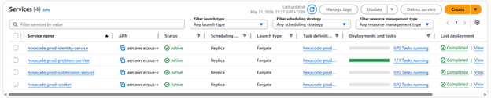

<sub>Note: hexacode-prod-problem-service đang chạy (1/1 Task running)</sub>

**Service after stop note:**

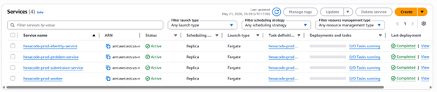

<sub>Note: Tất cả service chuyển sang trạng thái 0/0 Task running sau khi Lambda chạy.</sub>

**CloudTrail stop event:**


<sub>Note: Sự kiện UpdateService được ghi nhận. User name: CostGuardLambda xác nhận hành động này do Automation thực hiện, thay đổi desiredCount về 0 để dừng tiêu tốn chi phí Fargate.</sub>

---

### 3.5 Budgets daily $150 → SNS → Lambda (Wire + Demo)


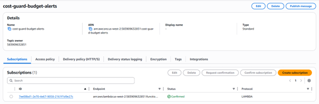

<sub>Note: Trạng thái Confirmed của Subscription với giao thức LAMBDA xác nhận rằng mọi thông báo 'ALARM' từ AWS Budgets sẽ được chuyển tiếp ngay lập tức đến Lambda function.</sub>


<sub>Note: Kết quả demo chuỗi hành động (End-to-end chain). Màn hình CloudShell thực hiện sns publish giả lập, ngay lập tức CloudWatch Logs (Live tailing) ghi nhận Lambda nhận event và thực hiện quét/tắt service thành công. Điều này xác nhận hệ thống sẵn sàng hoạt động trong Production mà không cần chờ dữ liệu billing thật (latency 8-24h).</sub>

**Test SNS publish — demonstrate chain:**

```bash
aws sns publish \
  --topic-arn arn:aws:sns:us-west-2:583909632851:cost-guard-topic \
  --message '{"AlarmName":"BudgetAlert","NewStateValue":"ALARM"}' \
  --region us-west-2
```

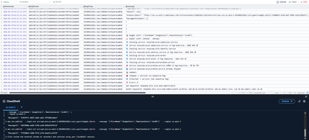

<sub>Note: Manual SNS publish trigger Lambda → Lambda stop một resource → xác nhận chain hoạt động end-to-end mà không cần chờ cost data thật.</sub>

---

### 3.6 Cost Data Latency — ADR

**Status:** Decided  
**Date:** 2026-05-21  
**Group:** Group 6 — HexaCode  
**Region:** us-west-2

#### Context
Trong quá trình vận hành hệ thống AWS tại Workshop W6, nhóm nhận thấy dữ liệu chi phí (AWS Billing & Cost Management) có độ trễ cập nhật từ **8 đến 24 giờ** trước khi xuất hiện chính thức trong Cost Explorer và kích hoạt các ngưỡng cảnh báo (Alerts) của AWS Budgets. 

Vì thời gian diễn ra workshop chỉ kéo dài 48 giờ, việc dựa hoàn toàn vào cơ chế kích hoạt tự động theo chi phí (Cost-driven trigger) từ Budgets là không khả thi, do dữ liệu tiêu dùng thực tế có thể chưa kịp ghi nhận trước khi buổi Demo kết thúc.

#### Decision
Nhóm HexaCode quyết định triển khai mô hình kiểm soát chi phí "lai" (Hybrid Governance Model) để đảm bảo tính sẵn sàng và khả năng demo:

1.  **Thiết lập liên kết (Wiring):** Hoàn tất đấu nối chuỗi logic: **AWS Budgets ($150 Daily)** -> **SNS Topic** -> **Lambda (`CostGuardLambda`)**. Đây là cơ chế phản ứng (Reactive) cho môi trường Production dài hạn.
2.  **Cơ chế kích hoạt chính (Primary Trigger):** Sử dụng **EventBridge Scheduler** (`daily-cost-guard`) chạy định kỳ theo **cron(0 9 * * ? *)** múi giờ **Asia/Ho_Chi_Minh**. Đây là cơ chế chủ động (Proactive) giúp dọn dẹp tài nguyên thừa hàng sáng mà không phụ thuộc vào độ trễ dữ liệu Billing.
3.  **Verification:** Sử dụng lệnh `aws sns publish` qua CloudShell để giả lập tín hiệu `ALARM` vượt ngưỡng ngân sách. Phương pháp này cho phép kiểm thử toàn bộ chuỗi phản ứng (End-to-end chain) ngay lập tức.

#### Technical Details
*   **Account ID:** `583909632851`
*   **Budget Threshold:** $150.00/day
*   **SNS Topic ARN:** `arn:aws:sns:us-west-2:583909632851:cost-guard-budget-alerts`
*   **Lambda Function:** `CostGuardLambda`
*   **Cron Schedule:** Chạy vào 09:00 AM hàng ngày (UTC+7).

#### Consequences
*   **Trong Workshop:** Nhóm đã chứng minh được khả năng tự động hóa việc dừng (Stop) các ECS Services thông qua việc giả lập sự kiện SNS. Behavior của hệ thống trong Production đã được xác nhận thành công mà không cần chờ dữ liệu chi phí thật.
*   **Trong Production thực tế:** Sự kết hợp này tạo ra lớp bảo mật chi phí 2 tầng: 
    *   **Tầng 1 (Schedule):** Ngăn chặn việc quên tắt tài nguyên vào giờ cao điểm.
    *   **Tầng 2 (Budget Alert):** Ngăn chặn các sự cố chi phí tăng đột biến do lỗi cấu hình hoặc bị tấn công tài nguyên, đảm bảo tổng thiệt hại không bao giờ vượt quá mức ngân sách đề ra.

---

## Section 4 — MH-OBS — CloudWatch Observability

### 4.1 CloudWatch Dashboard

> Temporary guide — xoá block này sau khi có ảnh thật.
> - AWS Console → **CloudWatch** → **Dashboards** → mở dashboard nhóm tạo cho W6.
> - Ảnh phải thấy đồng thời: 1 widget **custom metric** có title rõ ràng, và ít nhất 2 widget metric chuẩn.
> - Theo W6 spec, widget rỗng hoặc không có datapoint sẽ không đủ mạnh; nên generate traffic/invoke trước khi chụp.
> - Theo drift audit, live AWS đã có API access logs và backup-failure event logs, nhưng audit **không xác nhận** sẵn dashboard custom metric hoàn chỉnh; phần này nhiều khả năng vẫn phải tự hoàn thiện rồi mới chụp.


<sub>Note: Dashboard với 3 widget: (1) Custom metric `[tên metric]`, (2) Standard metric Lambda Error Rate, (3) Standard metric RDS DatabaseConnections. Mọi widget đều có data point thật.</sub>

### 4.2 Custom Metric — `PutMetricData` Code Snippet

> Temporary guide — xoá block này sau khi có ảnh thật.
> - `w6-custom-metric.png`: CloudWatch → **Metrics** → namespace custom của nhóm, ví dụ `HexaCode/Operations`.
> - Chụp màn hình khi nhìn thấy metric name, dimensions, và datapoints thật.
> - Chỉ dùng snippet code này nếu nó đúng với code app đang chạy; nếu chưa instrument thật thì đây mới chỉ là placeholder, chưa phải evidence.

**Metric đo gì:** `[e.g. Bedrock agent invocation latency ms]`

```python
import boto3
import time

cloudwatch = boto3.client('cloudwatch')

def handler(event, context):
    start = time.time()
    
    # [Business logic của app ở đây — gọi Bedrock, query DB, v.v.]
    
    latency_ms = (time.time() - start) * 1000
    
    cloudwatch.put_metric_data(
        Namespace='HexaCode/Operations',
        MetricData=[{
            'MetricName': 'BedrockAgentLatencyMs',
            'Value': latency_ms,
            'Unit': 'Milliseconds',
            'Dimensions': [
                {'Name': 'FunctionName', 'Value': 'hexacode-prod-chat'},
                {'Name': 'Environment', 'Value': 'dev'}
            ]
        }]
    )
```

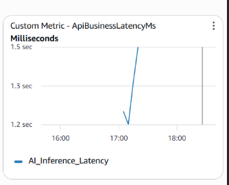
<sub>Note: Custom metric `BedrockAgentLatencyMs` trong namespace `HexaCode/Operations` — thấy data points thật từ Lambda invocations.</sub>

---

### 4.3 CloudWatch Alarm — Trạng thái OK hoặc ALARM

> Temporary guide — xoá block này sau khi có ảnh thật.
> - AWS Console → **CloudWatch** → **Alarms**.
> - Ảnh `w6-alarm-config.png` nên chụp detail của một alarm để thấy metric, threshold, evaluation periods, và action destination.
> - Ảnh `w6-alarm-state.png` nên chụp danh sách alarms hoặc detail panel có state là **OK** hoặc **ALARM**, tuyệt đối tránh `INSUFFICIENT_DATA` vì W6 rubric trừ điểm rất rõ.
> - Nếu metric chưa có datapoint, hãy generate traffic/lỗi trước rồi mới chụp.


<sub>Note: Alarm configuration — metric name, threshold, evaluation period (e.g. Lambda Errors > 5 trong 5 phút), action destination (SNS topic). Alarm đang ở trạng thái OK hoặc ALARM — không phải INSUFFICIENT_DATA.</sub>


<sub>Note: Alarm state screenshot chụp gần Thứ Sáu — xác nhận metric đã có data point để evaluate. Nếu cần, invoke Lambda với bad input 6 lần vào Thứ Năm để trigger alarm.</sub>

---

### 4.4 Log Insights Query — Saved

> Temporary guide — xoá block này sau khi có ảnh thật.
> - AWS Console → **CloudWatch** → **Logs Insights**.
> - Chọn log group thật của app, ví dụ API Gateway access logs hoặc `/aws/lambda/...`.
> - `w6-log-insights-result.png`: chụp cùng lúc query text, tên log group, và ít nhất 5 dòng kết quả.
> - `w6-log-insights-saved.png`: chụp danh sách **Saved queries** để thấy query name đã được lưu.
> - Theo drift audit, live AWS đã xác nhận API access logs được enable; đây là nguồn log rất hợp lý để chụp nếu nhóm chưa có Lambda log đẹp.

**Query text:**

```bash
# Lambda error spikes by 5-minute window
fields @timestamp, @message
| filter @message like /ERROR/
| stats count(*) as error_count by bin(5m)
| sort @timestamp desc
```

**Log group chạy chống lại:** `/aws/lambda/hexacode-prod-chat`


<sub>Note: Query trả về ít nhất 5 result rows thật. Thấy tên query đã save trong danh sách Saved Queries.</sub>


<sub>Note: Saved query name nhìn thấy trong CloudWatch → Log Insights → Saved Queries.</sub>

---

## Section 5 — MH-SEC — Self-Healing Security Guard

### 5.1 Security Guard Lambda

> Temporary guide — xoá block này sau khi có ảnh thật.
> - Trước tiên chốt **một** path demo chính: `S3 public -> PutPublicAccessBlock` hoặc `SG 0.0.0.0/0:22 -> RevokeSecurityGroupIngress`.
> - AWS Console → **Lambda** → chọn function Security Guard của nhóm → chụp phần function name, runtime, trigger summary, và last modified.
> - Theo W6 spec, điểm nằm ở detect→fix loop có thật; đừng chỉ chụp function tồn tại mà chưa có remediation evidence.

**Misconfiguration detect và fix:** `[e.g. S3 bucket bị set public → Lambda gọi PutPublicAccessBlock]`
hoặc `[e.g. Security Group ingress 0.0.0.0/0 trên port 22 → Lambda gọi RevokeSecurityGroupIngress]`

**Screenshot Lambda function:**


<sub>Note: Lambda function đã deploy với least-privilege IAM role.</sub>

**Lambda code snippet:**

```python
import boto3

s3 = boto3.client('s3')

def handler(event, context):
    # Lấy bucket name từ CloudTrail event (nếu trigger từ EventBridge)
    bucket_name = event.get('detail', {}).get('requestParameters', {}).get('bucketName')
    
    if not bucket_name:
        # Fallback: scan tất cả bucket nếu trigger từ scheduled cron
        buckets = s3.list_buckets()['Buckets']
        for bucket in buckets:
            check_and_fix_bucket(bucket['Name'])
        return
    
    check_and_fix_bucket(bucket_name)

def check_and_fix_bucket(bucket_name):
    try:
        status = s3.get_public_access_block(Bucket=bucket_name)
        config = status['PublicAccessBlockConfiguration']
        if not all(config.values()):
            s3.put_public_access_block(
                Bucket=bucket_name,
                PublicAccessBlockConfiguration={
                    'BlockPublicAcls': True,
                    'IgnorePublicAcls': True,
                    'BlockPublicPolicy': True,
                    'RestrictPublicBuckets': True
                }
            )
            print(f"Fixed public access on bucket: {bucket_name}")
    except Exception as e:
        print(f"Error checking bucket {bucket_name}: {e}")
```

---

### 5.2 IAM Role — Least Privilege

> Temporary guide — xoá block này sau khi có ảnh thật.
> - Từ function Security Guard → **Configuration** → **Permissions** → click execution role.
> - Nếu chọn path S3, ảnh policy nên lộ rõ các quyền như `s3:PutPublicAccessBlock` và các quyền read tối thiểu liên quan.
> - Nếu chọn path SG, ảnh policy nên lộ rõ `ec2:RevokeSecurityGroupIngress` + quyền describe cần thiết.


<sub>Note: IAM execution role chỉ có `s3:PutPublicAccessBlock`, `s3:GetBucketPolicyStatus`, `s3:ListAllMyBuckets` — hoặc `ec2:RevokeSecurityGroupIngress`, `ec2:DescribeSecurityGroups`. Không có wildcard.</sub>

---

### 5.3 EventBridge Trigger

> Temporary guide — xoá block này sau khi có ảnh thật.
> - Nếu chọn real-time path: AWS Console → **EventBridge** → **Rules** → rule match CloudTrail event như `PutBucketPolicy`, `PutBucketAcl`, hoặc `AuthorizeSecurityGroupIngress`.
> - Nếu chọn scheduled fallback: AWS Console → **EventBridge Scheduler** → schedule daily cron.
> - Chụp màn hình phải thấy rule/schedule name, event pattern hoặc cron expression, target Lambda, và status **Enabled**.
> - Theo W6 spec, EventBridge rule trên CloudTrail event là evidence mạnh hơn cho self-healing loop; cron fallback vẫn hợp lệ nhưng nên mô tả rõ.

**Trigger type đã chọn:** `[ ] EventBridge rule trên CloudTrail event` &nbsp;&nbsp; `[ ] EventBridge Scheduler daily cron`


<sub>Note: EventBridge rule trên event source `aws.s3` / event `PutBucketPolicy` / `PutBucketAcl` — hoặc daily cron schedule. Rule đang Enabled.</sub>

---

### 5.4 Demo Vòng Lặp Detect → Fix

> Temporary guide — xoá block này sau khi có ảnh thật.
> - `w6-sec-before.png`: chụp trạng thái **insecure** ngay sau khi cố ý tạo vi phạm.
> - `w6-sec-after.png`: chụp cùng resource sau khi Lambda đã remediate.
> - `w6-cloudtrail-remediation.png`: AWS Console → **CloudTrail** → **Event history** → filter `PutPublicAccessBlock` hoặc `RevokeSecurityGroupIngress`.
> - Ảnh CloudTrail phải cho thấy eventName, eventTime, và resource bị sửa; nếu thấy principal/role của Lambda thì càng mạnh.
> - Với path S3, chọn bucket thật của app nhưng tránh bucket nhạy cảm khó rollback. Với path SG, dùng security group test để tránh ảnh hưởng production path ngoài ý muốn.

**Before — Vi phạm được tạo cố ý:**


<sub>Note: S3 bucket bị set public (Block Public Access tắt) — hoặc Security Group có rule 0.0.0.0/0 port 22. Đây là trạng thái "insecure" trước khi Lambda chạy.</sub>

**After — Lambda đã fix:**


<sub>Note: Cùng bucket/SG sau khi Lambda detect và remediate — Block Public Access bật lại / rule 0.0.0.0/0 đã bị revoke.</sub>

**CloudTrail event của lần gọi fix API:**


<sub>Note: CloudTrail event `PutPublicAccessBlock` / `RevokeSecurityGroupIngress` — thấy eventName, eventTime, userAgent (Lambda role ARN), và resource bị fix. Đây là bằng chứng remediation đã thực sự chạy.</sub>

---

### 5.5 Supporting Preventive Control

> Temporary guide — xoá block này sau khi có ảnh thật.
> - Chọn **một** path rồi xoá hai path còn lại để evidence pack gọn.
> - Theo drift audit hiện tại, path dễ bám live AWS nhất có thể là **S3 Block Public Access account-level** hoặc **IAM Access Analyzer** nếu account đã bật; còn path **KMS CMK** cần chắc chắn có service thật dùng key và có CloudTrail `GenerateDataKey`/`Decrypt`.

**Path đã chọn:** `[ ] Path A — KMS CMK` &nbsp;&nbsp; `[ ] Path B — S3 Block Public Access account-level` &nbsp;&nbsp; `[ ] Path C — IAM Access Analyzer`

---

**Nếu Path A — KMS CMK:**

> Temporary guide — xoá block này sau khi có ảnh thật.
> - AWS Console → **KMS** → **Customer managed keys** → chọn key alias của nhóm.
> - `w6-kms-cmk.png`: chụp alias, key spec, rotation enabled.
> - `w6-kms-applied.png`: chụp service đang dùng CMK, ví dụ RDS/EFS/S3.
> - `w6-kms-cloudtrail.png`: CloudTrail filter `GenerateDataKey` hoặc `Decrypt`, rồi xác nhận caller service như `rds.amazonaws.com` hoặc `s3.amazonaws.com`.


<sub>Note: Customer Managed Key `alias/hexacode-rds-prod` đã tạo, Symmetric, key rotation Enabled.</sub>


<sub>Note: RDS / EFS / S3 đã được modify để dùng CMK (không phải aws/rds hay aws/s3 — AWS-managed key).</sub>


<sub>Note: CloudTrail event `kms:GenerateDataKey` từ `rds.amazonaws.com` / `s3.amazonaws.com` — xác nhận CMK đang được dùng active khi data được encrypt/decrypt.</sub>

---

**Nếu Path B — S3 Block Public Access account-level:**

> Temporary guide — xoá block này sau khi có ảnh thật.
> - AWS Console → **S3** → **Block Public Access settings for this account**.
> - `w6-s3-bpa-account.png`: chụp cả 4 toggle ON.
> - `w6-s3-deny-policy.png`: chụp bucket policy deny non-TLS hoặc deny unencrypted PutObject.
> - `w6-s3-test-denied.png`: chụp lỗi/deny result của test call.


<sub>Note: S3 console → Block Public Access settings for this account → cả 4 setting đều ON.</sub>


<sub>Note: Bucket policy deny PutObject non-TLS (`aws:SecureTransport=false`).</sub>


<sub>Note: Test call bị policy reject — xác nhận enforce đang hoạt động.</sub>

---

**Nếu Path C — IAM Access Analyzer:**

> Temporary guide — xoá block này sau khi có ảnh thật.
> - AWS Console → **IAM** → **Access Analyzer**.
> - `w6-access-analyzer.png`: chụp analyzer enabled.
> - `w6-access-analyzer-finding.png`: chụp ít nhất 1 external-access finding + decision triage.
> - Nếu account chưa bật Access Analyzer, path này sẽ phát sinh thêm setup nên không phải đường ngắn nhất.


<sub>Note: IAM Access Analyzer đã enable trong account.</sub>


<sub>Note: ≥1 external-access finding được surface. Triage decision: finding này là gì, có phải intended không, production remediation là gì.</sub>

---

### 5.6 Security Threat Statement

> Temporary guide — xoá block này sau khi viết xong.
> - Viết theo cấu trúc: `misconfiguration là gì -> data/asset nào bị ảnh hưởng -> attacker có thể làm gì`.
> - Tránh viết chung chung kiểu “bị hack”; rubric muốn thấy blast radius cụ thể.

**Guard fix misconfiguration gì:**
`[e.g. "S3 bucket chứa Bedrock KB documents bị set public — mọi người trên internet có thể đọc toàn bộ nội dung knowledge base của app."]`

**Blast radius nếu không remediate:**
`[e.g. "Toàn bộ 36 markdown documents của GeekBrain — bao gồm incident postmortems, SLA targets, team structure — bị lộ công khai. Kẻ tấn công có thể dùng thông tin này để social engineer hoặc target specific vulnerabilities."]`

---

### 5.7 Security-Cost Trade-off Statement

> Temporary guide — xoá block này sau khi viết xong.
> - Nêu **chi phí cụ thể** của control đã chọn, hoặc nói rõ là gần như zero-cost nếu chọn account-level BPA / deny policy.
> - Sau đó giải thích vì sao chi phí đó đáng trả so với blast radius ở trên.

`[1-2 câu nêu tên cost cụ thể và justification. Ví dụ: "KMS CMK tốn $1/tháng per key. Justified vì mỗi decrypt event được log kèm IAM principal — đây là audit trail bắt buộc khi data store chứa thông tin thi cử của người dùng. Cost $1/tháng nhỏ hơn nhiều so với rủi ro compliance khi không có audit trail."]`

---

## Section 6 — Project Recap

### Ứng dụng là gì

`[Mô tả ngắn: HexaCode là một coding practice platform cho phép người dùng luyện tập bài tập lập trình, nộp bài, và nhận hỗ trợ từ AI chatbot.]`

### Business Domain

`[e.g. EdTech / Competitive Programming / Online Judge]`

### Các quyết định kiến trúc và thiết kế chính từ W1-W5

| Tuần | Quyết định chính |
|---|---|
| W1 | `[e.g. 3-tier architecture: CloudFront → API Gateway → ECS Fargate → RDS]` |
| W2 | `[e.g. S3 cho static assets, IAM baseline với MFA trên root]` |
| W3 | `[e.g. RDS PostgreSQL / relational vì data có JOIN phức tạp giữa users-submissions-problems]` |
| W4 | `[e.g. Bedrock Agent với Knowledge Base, Lambda orchestrator, Hybrid Search K=10]` |
| W5 | `[e.g. VPC Peering Production↔Management, Network Firewall với domain allowlist, EFS mount, API Gateway + auth]` |
| W6 | `[e.g. Cost tagging discipline, automated cost guard, CloudWatch observability, self-healing security]` |

---

## Bonus *(Tuỳ chọn)*

> Chỉ điền nếu đã hoàn tất cả 4 must-have và Evidence Pack.

### B1 `[ ]` gp2 → gp3 EBS Migration (+0.25)

**Before (gp2):**


<sub>Note: Volume type gp2, IOPS và BurstBalance baseline từ CloudWatch.</sub>

**After (gp3):**


<sub>Note: Volume type gp3, IOPS/throughput đã cấu hình, cost delta so với gp2.</sub>

---

### B2 `[ ]` Trusted Advisor Remediations (+0.25)

**Finding 1:**


<sub>Note: Finding → Action taken → Before/After.</sub>

**Finding 2:**


<sub>Note: Finding → Action taken → Before/After.</sub>

---

### B3 `[ ]` RI / Savings Plans Break-even Analysis (+0.25)

`[Viết analysis với con số thật. Ví dụ: "Break-even cho 1-year Compute Savings Plan trên ECS Fargate: on-demand cost $X/tháng × 12 = $Y. Savings Plan commitment $Z × 12 = $W. Break-even tại tháng thứ N. Vòng đời workshop 1 tuần → không mua. Sẽ mua khi sustained spend > $X/tháng trong 3+ tháng liên tiếp."]`

---

### B4 `[ ]` "Wasteful → Changed" Reflection (+0.25)

`[100-150 từ với con số thật: tìm thấy gì lãng phí, đã thay đổi gì, cost/performance delta là bao nhiêu.]`

---

### B5 `[ ]` Cost Anomaly Automation (+0.25)


<sub>Note: Monitor scope về `Application=HexaCode`, EventBridge rule trên `aws.costanomalydetection`, SNS notification nhận được.</sub>

---

### B6 `[ ]` CloudFormation Template cho một resource W6 (+0.25)

```yaml
# Paste CFN template snippet ở đây
# Provision Security Guard Lambda + EventBridge trigger + IAM role
```


<sub>Note: `aws cloudformation validate-template` output — template pass validation.</sub>

---

*— End of W6 Evidence Pack —*
